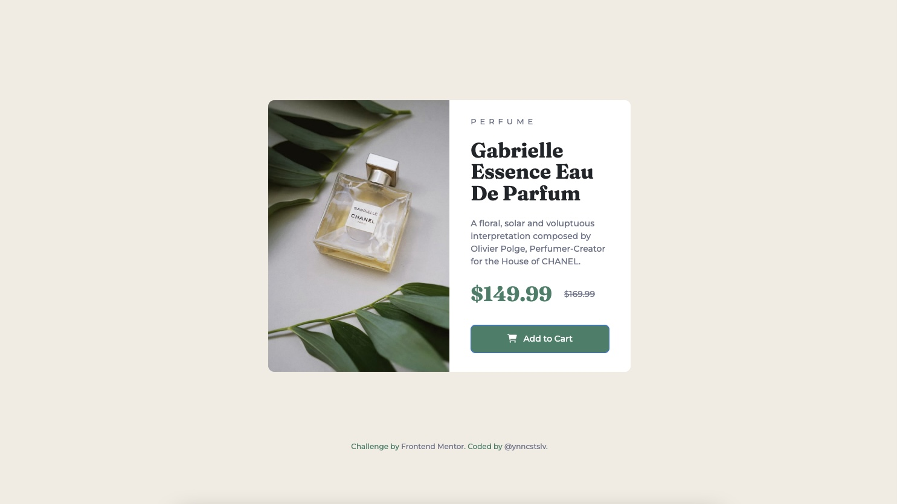

# Frontend Mentor - Product Preview Card Component Solution

This is a solution to the <a href="https://www.frontendmentor.io/challenges/product-preview-card-component-GO7UmttRfa">"Product Preview Card Component Challenge"</a> on Frontend Mentor.
<br>
Frontend Mentor challenges help ypu improve your coding skills by building realistic projects.

# 📖 Table of contents

- [Brief](#📋-brief);
- [Screenshot](#🖥-screenshot);
- [Technologies](#🔧-technologies);
- [Code](#💾-code);
- [Author](#🧔-author);

# 📋 Brief

Build out a product preview card component and get it looking as close to the design as possible.
<br>
Use any tools to help the completion of the challenge.
<br>
Users should be able to:
<br>
- View the optimal layout depending on their device's screen size;
- See hover and focus states for interactive elements;

# 🖥 Screenshot



# 🔧 Technologies


# 💾 Code

```html
<body>
        <!-- // main container ===== start -->
        <div class="container-fluid">
            <!-- // card container & columns ===== start -->
            <div class="card-container">
                <!-- // left container ===== start -->
                <div class="column-left">
                    
                </div>
                <!-- // left container ===== end -->
                <!-- // right container ===== start -->
                <div class="column-right">
                    <h4 id="perfume">PERFUME</h4>
                    <h1 id="title">Gabrielle Essence Eau De Parfum</h1>
                    <p id="description">A floral, solar and voluptuous interpretation composed by Olivier Polge, Perfumer-Creator for the House of CHANEL.</p>
                    <div class="price-line">
                        <h1 id="price">$149.99</h1>
                        <h4 id="discount">$169.99</h4>
                    </div>
                    <button type="button" class="btn btn-primary btn-lg"><i class="fa-solid fa-cart-shopping"></i> Add to Cart</button>
                </div>   
                <!-- // right container ===== end -->             
            </div>
            <!-- // card container & columns ===== end -->
            <!-- // attribution ===== start -->
            <div class="attribution">
                Challenge by <a href="https://www.frontendmentor.io?ref=challenge" target="_blank">Frontend Mentor</a>. 
                Coded by <a href="https://github.com/ynncstslv" target="_blank">@ynncstslv</a>.
            </div>
            <!-- // attribution ===== end -->
        </div>
        <!-- // main container ===== end -->

        <!-- // bootstrap js ===== start // -->
        <script src="https://cdn.jsdelivr.net/npm/bootstrap@5.2.0-beta1/dist/js/bootstrap.bundle.min.js" integrity="sha384-pprn3073KE6tl6bjs2QrFaJGz5/SUsLqktiwsUTF55Jfv3qYSDhgCecCxMW52nD2" crossorigin="anonymous"></script>
        <!-- // bootstrap js ===== end // -->
    </body>
```

```css
/* fonts */

@import url('https://fonts.googleapis.com/css2?family=Fraunces:opsz,wght@9..144,700&family=Montserrat:wght@500;700&display=swap');

/* color palette */

:root {
    /* primary */
    --color-cream: hsl(30, 38%, 92%);
    --color-dark-cyan: hsl(158,36%, 37%);
    --color-dark-green: #06300e;
    /* neutral */
    --color-white: hsl(0, 0%, 100%);
    --color-grayish-blue: hsl(228, 12%, 48%);
    --color-dark-blue: hsl(212, 21%, 14%);
    /* attribution */
    --color-blue: hsl(228, 45%, 44%);
}

/* default reset */

* {
    margin: 0;
    padding: 0;
    box-sizing: border-box;
}

body {
    font-family: 'Montserrat', sans-serif;
}

/* main container */

.container-fluid {
    width: 100%;
    min-height: 100vh;
    position: relative;
    display: flex;
    align-items: center;
    justify-content: center;
    padding: 2rem;
    background: var(--color-cream);
    overflow: hidden;
}

/* card container & columns */

.card-container {
    width: 100%;
    max-width: 600px;
    display: grid;
    grid-template-columns: repeat(2, 1fr);
    border-radius: 10px;
    background: var(--color-white);
    overflow: hidden;
    z-index: 1000;
}

.column-left {
    background: var(--color-dark-green);
}

.column-right {
    position: relative;
    padding: 1.8rem 2.2rem;
    background: var(--color-white);
}

/* information */

#perfume {
    margin-bottom: 1.4rem;
    font-size: 13px;
    letter-spacing: 6px;
    color: var(--color-grayish-blue);
}

#title {
    margin-bottom: 1.4rem;
    font-family: 'Fraunces';
    font-size: 34px;
    font-weight: 700;
    line-height: 2.2rem;
}

#description {
    margin-bottom: 1.4rem;
    font-size: 14px;
    color: var(--color-grayish-blue);
}

.price-line {
    display: flex;
    align-items: center;
    margin-bottom: 1.4rem;
}

#price {
    font-family: 'Fraunces';
    font-size: 34px;
    font-weight: 700;
    padding-right: 20px;
    color: var(--color-dark-cyan);
}

#discount {
    font-size: 14px;
    text-decoration: line-through;
    color: var(--color-grayish-blue);
}

/* button */

i {
    display: inline-block;
    margin-right: 7px;
}

.btn {
    padding: 12px 50px;
    width: 100%;
    font-size: 14px;
    color: var(--color-white);
    background: var(--color-dark-cyan);
    transition: all 0.3s ease 0s;
}

.btn:hover {
    background: var(--color-dark-green);
}

/* attribution */

.attribution {
    position: absolute;
    bottom: 100px;
    font-size: 12px;
    color: var(--color-dark-cyan);
}

.attribution a {
    text-decoration: none;
    color: var(--color-grayish-blue);
    transition: all 0.3s ease 0s;
}

.attribution a:hover {
    color: var(--color-dark-green);
}

/* media query */

@media (max-width: 820px) {
    .card-container {
        grid-template-columns: 1fr;
    }
    .image-desktop {
        display: none;
    }
    .image-mobile {
        display: block;
        width: 100%;
    }
}

@media (max-width: 768px) {
    .attribution {
        bottom: 50px;
    }
}

@media (max-width: 412px) {
    .attribution {
        font-size: 11px;
    }
}

@media (max-width: 375px) {
    .attribution {
        font-size: 10px;
        bottom: 10px;
    }
}
```

# 🧔 Author

- <a href="https://github.com/ynncstslv" target="_blank">GitHub</a>;
- <a href="https://linkedin.com/in/ynncstslv" target="_blank">LinkedIn</a>;
- <a href="https://codepen.io/ynncstslv" target="_blank">Codepen</a>;
- <a href="https://instagram.com/ynncstslv" target="_blank">Instagram</a>;
- <a href="https://twitter.com/ynncstslv" target="_blank">Twitter</a>;
